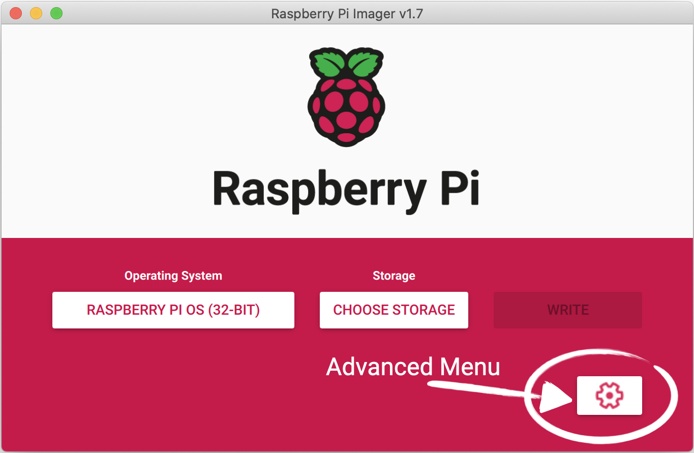

[İndex](../README.md)

# MİKRO DENETLEYİCİ (RASPBERRY PI 3B+)

Bu döküman, Raspberry Pi işletim sistemini sıfırdan kurup, harici bir ekran ile gerekli kalibrasyonları yapmak isteyen kişiler için hazırlanmıştır. 

**İndex**

  - [1. Raspberry Pi Kurulumu](#1-raspberry-pi-kurulumu)
  - [2. Ekran (Touchscreen) ile Raspberry Pi Konfigürasyonu](#2-ekran-touchscreen-ile-raspberry-pi-konfigürasyonu)


## 1. Raspberry Pi Kurulumu

Raspberry Pi işletim sisteminin kurulması için, herhangi bir SD kartına “Raspberry Pi Disk Image” dosyalarının yazılması gerekir. İlgili dosyayı bulup SD kartına yazma işlemini bizim yerimize yapan bir uygulama var: “Raspberry Pi Disk Imager”. Bu programı [linkinden](https://www.raspberrypi.com/software/), kendinize uygun işletim sistemi seçeneğini seçerek indirin. Daha sonrasında ise [linkinde](https://www.raspberrypi.com/documentation/computers/getting-started.html) yer alan adımları izleyerek, SD kartınıza Raspberry Pi güncel işletim sistemi dosyalarını yazdırın. Dosyaları yazdırmadan önce, “Raspberry Pi Disk Imager” üzerinde bulunan “ayarlar” simgesinden (resimdeki Advanced Menu simgesi) , “hostname”, “password” ve wifi alanlarını girdiğinizden ve “Enable SSH” seçeneğini seçtiğinizden emin olun. Uygulamamızın dosyalarını Raspberry Pi’a SSH üzerinden göndereceğiniz için en başından SSH seçeneğini aktif yapmak önemli. Bunların dışında istediğiniz ayarları da ekstradan girebilirsiniz.



İlgili dosyaların yazdırılması bittikten sonra, SD kartınızı Raspberry Pi’a takın. Yüklediğiniz işletim sisteminin doğru çalışıp çalışmadığını, devre kartına güç verince göremezsiniz. Bunun sebebi, ilk etapta devre kartına taktığınız ekran ile Raspberry Pi işlemcisinin konfigürasyonunun yapılmamış olmasındandır (Bu konfigürasyon “2. Ekran (Touchscreen) ile Raspberry Pi Konfigürasyonu” bölümünde gösterilecektir). Düzgün bir disk image dosyasını yükleyip yüklemediğinizi kontrol etmek için, Raspberry Pi devre kartınıza monitör, klavye ve fare bağlayın. Daha sonrasında devre kartına güç vererek, Raspberry Pi masaüstü görüntüsünün geldiğinden emin olun. 

## 2. Ekran (Touchscreen) ile Raspberry Pi Konfigürasyonu

Raspberry Pi’a harici bir monitör bağladığınızda gördüklerinizi, devre kartınızın üzerinde bulunan ekrana yansıtmak için öncelikle bazı konfigürasyonların yapılması gerekmektedir. Bu konfigürasyonların en başından nasıl yapılacağı [linkinde](https://www.youtube.com/watch?v=Mi1XhfuzBps) bulunan Youtube videosunda ayrıntılı bir şekilde gösterilmiştir. İlgili kodlar ise [linkinde](https://www.waveshare.com/wiki/3.5inch_RPi_LCD_(A)) yer almaktadır. Bizim kullandığımız ekran 3.5inch RPi LCD (A) olduğu için bu dökümanı referans alıyoruz. Eğer ekranın başka bir çeşidini kullanıyorsanız, [sayfasındaki](https://www.waveshare.com/wiki/Main_Page) “Displays” bölümünden size uygun ekran çeşidinin dökümanını seçmelisiniz.

Konfigürasyon için ilgili adımlar şöyledir: 

1. Öncelikle Raspberry Pi’ınızı, güç vererek çalışır hale getirin.
2. Raspberry’i internete bağlayın.
3. Raspberry’nin ip adresini öğrenin.
   * Terminal’den herhangi bir internet adresine “*ping*” atarak veya
   * Terminal’e “*ifconfig*” yazarak ip adresini öğrenebilirsiniz.
4. Bilgisayarınızdan “*Putty*” uygulamasını açın.
5. Raspberry Pi’ın ip adresini girip, portu 22 ve bağlantı tipini “*SSH*” seçerek, Raspberry Pi’a bağlanın.
6. Putty’de hostname ve parola bilgileriniz ile giriş yapın.
7. Aşağıdaki komutu yazın. LCD-show’un yüklenmesini bekleyin.
    ```
        git clone https://github.com/waveshare/LCD-show.git
    ```
8. LCD-show’un yüklenmesi tamamlandıktan sonra 

    ```
        cd LCD-show/
    ```

   diyerek, LCD-show klasörüne gidin.

9. Klasöre girdikten sonra, aşağıdaki komutla beraber LCD35-show dosyasının yetkisini değiştirin:

    ```
        chmod +x LCD35-show
    ```
10. Daha sonra LCD35-show driver’ının yüklenebilmesi için, aşağıdaki komutu çalıştırın:
    ```
        ./LCD35-show
    ```

11. Yukarıdaki komutu çalıştırdıktan sonra, Raspberry Pi kendini kapatıp açacağı için bağlantınız kesilecektir. Bu ve bundan sonraki her bağlantınız kesildiğinde, Putty’den “*Restart Connection*” yaparak Raspberry Pi’a tekrardan bağlanıp, aşağıdaki adımlara devam edebilirsiniz.
12. Raspberry Pi’ımız tekrardan açıldığında, 8. Adımı tekrardan yapın.
13. Daha sonrasında, aşağıdaki komutu çalıştırın:
    ```
        ./LCD35-show 180
    ```
  Bu komut, ekranımızı 180 derece döndürmektedir.

14. 13. Adımdaki komuttan sonra Raspberry Pi kendini baştan başlatacaktır.
15. Tekrardan açıldıktan sonra, kalibrasyon ayarlarına geçebilirsiniz. Aşağıdaki komutu çalıştırarak, kalibrasyon dosyasını sisteme yükleyin:
    ```
        sudo apt-get install xinput-calibrator
    ```
16. Eğer ekranınız farklı boyuttaysa, ilk başta kendiniz kalibrasyon yapmalısınız. Eğer 3.5inch ise, 21. Adımdan devam edebilirsiniz.
17. Kendiniz kalibrasyon yapmak için, Raspberry Pi’da en soldaki “*Menu*”ye (yani Raspberry Pi’ın simgesine) tıklayın.
18. “*Preference*” yazısına tıklayın.
19. “*Calibrate Touchscreen*” yazısına tıklayın. Bu aşama ile beraber, aşağıda verilen şekildeki gibi bir görüntü çıkacaktır. Kırmızı ile işaret edilen yerlere Raspberry Pi kalemiyle dokunun.

 

20. Bu işlemden sonra aşağıdaki gibi bir görüntü çıkacaktır. Bu görüntüdeki bilgileri not alın.

 

21. Eğer ekranınız 3.5inch ise 20. Adımdaki “*Option “Calibration”*” bilginiz, 
“*3919 208 236 3913*” şeklindedir. Diğer tüm bilgiler 20. Adımdaki şekil ile aynıdır.

22. Eğer yoksa “*xorg.conf.d*” klasörünü oluşturmamız gerekiyor. Bunun için aşağıdaki komutu çalıştırın.
    ```
        sudo mkdir /etc/X11/xorg.conf.d
    ```

23. Daha sonra, bu klasörün içine ”*99-calibration.conf*” dosyasını oluşturup bu dosyanın içine 20. Adımda gösterilen şekildeki bilgileri girin. 

**Hatırlatma:** “*Option “Calibration”*” bilgisi, daha önceki adımlarda bahsettiğimiz gibi kendi bilginiz olmalıdır veya 3.5inch kullanıyorsanız 21. Adımdaki gibi olmalıdır.

”*99-calibration.conf*” dosyasına dediğimiz bilgileri yazabilmek için aşağıdaki komutu çalıştırın (“*nano*” yerine, başka bir text edit aracı da kullanabilirsiniz): 

24. ”*99-calibration.conf*” dosyasına ilgili bilgileri yazdıktan sonra, sistemi restart etmek için aşağıdaki komutu çalıştırın:
     ```
        sudo reboot
    ```

25. Sistem açılınca, 8. Adımı tekrarlayın.
26. Daha sonra, aşağıdaki komutu çalıştırın:
    ```
        ./LCD35-show 0
    ```

  Bu komut, ekranınızı, 180 derece döndürmeden önceki haline getirecektir.

27. Artık fare imcelini ortadan kaldırabilirsiniz. Bunun için aşağıdaki adımları izlemeye devam edin.

28. Fare imlecini ortadan kaldırmak için, “*lightdm.conf*” dosyasındaki bir bilginin değiştirilmesi lazım. İlgili dosyayı değiştirebilmek için, aşağıdaki komutu çalıştırın:
     ```
        sudo nano /etc/lightdm/lightdm.conf
    ```

29. İlgili dosyada, “*xserver-command = X*“ yazan yeri bulun ve bu satıra “*-nocursor*” kelimesini ekleyin. Yani bu satırın son görünümü aşağıdaki gibi olacaktır:
    ```
        xserver-command = X -nocursor
    ```
30. Yaptığınız değişikliği kaydedip, Raspberry Pi’yı baştan başlatınca ( komut ekranına “*sudo reboot*” yazarak) artık fare imlecimiz de ortadan kalkmış oluyor. 

Bu adımlardan sonra Raspberry Pi ve Raspberry Pi’ın ekranının kalibrasyonu bitmiş oluyor. Artık SSH ile (veya istediğiniz başka bir yöntem ile) kendi dosyalarınızı gönderip, Raspberry Pi üzerinde çalıştırabilirsiniz.

[İndex](../README.md)
